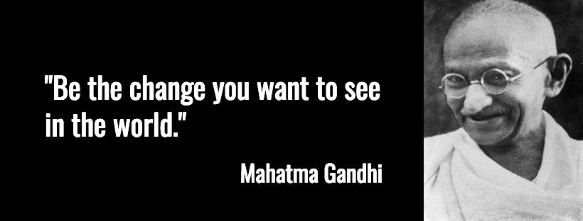
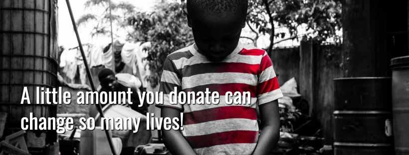

O Brasil vive hoje os efeitos da maior crise econômica das últimas décadas. E as eleições de 2018 trouxeram ainda mais desequilíbrio para uma nação instável.

Com o resultado das eleições, muitos brasileiros apostam que futuro presidente solucionará o problema econômico (entre outros) e esperam aciosamente 2019. Outros acreditam que a única oportunidade para uma vida melhor é mudar para outro país.

A grande verdade é que aqueles que ficarem no país, seja por vontade própria ou não, serão responsáveis por reerguer e reconstruir uma nação dividida por ideologias, preconceitos, extremismos e, muitas vezes, ódio. Felizes ou não com o nosso governo atual ou o que há de vir, esses cidadãos terão um grande tarefa à frente. Mas nosso papel de cidadão não pode parar no voto!

Nós, do Ajude Quem Fica, somos brasileiros que acreditam em um Brasil de oportunidades, no qual empatia, compaixão, caridade e respeito serão essenciais para regenerar nosso país. Sem associação a entidades religiosas, partidos ou movimentos políticos, buscamos praticar a bondade, sem preconceitos e sem restrições. Temos certeza de que vale a pena lutar pelo povo brasileiro e temos esperança em um Brasil melhor, construído pela união dos cidadãos.

Junte-se a nós nesse movimento em prol dos brasileiros que estão e ficarão no Brasil, independente de quem ocupa ou ocupará a presidência do Brasil. Ajude aqueles que sofrem diariamente com preconceitos, injustiças e desigualdades. **Seu poder como cidadão vai muito além de um voto!**

Colabore com o nosso projeto e vamos  mostrar ao mundo que nós, brasileiros, podemos ser, acima de tudo, um povo generoso!

## Quais são os objetivos dessa campanha?

Além de reunir pessoas que estejam determinadas a ajudar o Brasil, independente do resultado das eleições para presidência de 2018, e despertar a compaixão adormecida no coração de muitos brasileiros, temos as seguintes metas:

## Objetivos iniciais

* Arrecadar o valor inicial de R\$5.000,00 que serão distribuídos para, no mínimo, 5 entidades de assistência social / instituições de caridade1 pelo Brasil;

* Promover, de modo transparente, a indicação de instituições de caridade2 e votação para guiar a distribuição do valor arrecadado na campanha. **A priori, queremos ajudar instituições preocupadas com problemas atuais imediatos, como fome e moradia, e também que preparem para o futuro por meio da educação e capacitação de pessoas**;

* Criar um eBook sobre o Ajude Quem Fica, sobre as instituições beneficiadas, como o dinheiro distribuído foi aplicado e sobre o desfecho da campanha em geral;

* Criar uma plataforma que faça a interface entre entidades de assistência social / instituições de caridade e possíveis voluntário (sem a utilização dos recursos arrecadados nessa campanha).

## Objetivos futuros (que dependem do valor arrecadado)

* Promover instituições de caridade através de artigos, fotos, vídeos e divulgação em mídias sociais;

* Auxiliar o maior número possível de entidades de assistência social / instituições de caridade, seguindo o mesmo processo de indicação e votação.

## Gostou das ideias da nossa campanha? Quer nos ajudar?

Se você gostou das ideias do Ajude Quem Fica, a ajuda mais simples é doar algum valor aqui na página da campanha. Só precisamos de 500 pessoas doando somente R\$10 para atingirmos nossa meta inicial!

*Você sabia que com R\$100 você poderia prover **100** refeições para moradores de rua no restaurante Bom Prato? E com o mesmo valor você poderia prover **200** cafés-da-manhã para moradores de rua, no mesmo restaurante?*

*Você sabia que cerca de 50 milhões de brasileiros, o equivalente a 25,4% da população, vivem na linha de pobreza e têm renda familiar equivalente a R\$387,07 - ou US\$5,5 por dia3 – aproximadamente 40% do salário mínimo atual no Brasil (R\$954)?*

Gostou das ideias, mas o orçamento está todo comprometido esse mês? Não tem problema! Ajude a promover essa nossa campanha, compartilhando o link com seus familiares e amigos!!!

Quer fazer mais além de doar dinheiro? Entre em contato conosco através [deste formulário](http://bit.ly/ajude-quem-fica-voluntario)! Atualmente estamos precisando especificamente de voluntários com conhecimento em divulgação em mídias sociais, design e captação e edição de vídeos!

1 Ainda não temos uma lista de instituições porque desejamos que a escolha seja democrática e a indicação das instituições seja feita por aqueles que colaborarem com a campanha.

2 Para **registar a indicação da instituição de caridade de sua escolha**, preencha este formulário http://bit.ly/registro-de-entidate-ajude-quem-fica.

3 Os dados foram publicados pelo IBGE em dezembro de 2017 e você pode baixar o eBook [aqui](https://biblioteca.ibge.gov.br/index.php/biblioteca-catalogo?view=detalhes&id=2101459). Esses dados são de 2016 e não queremos esconder isso. Mas são os dados oficiais mais recentes disponíveis nesse momento.

# English version

Brazil is currently going through the greatest economic crisis of the last decades. And 2018 elections brought even more imbalance to an unstable nation.

With the result of the elections, many Brazilians bet that the future president will solve the economic problem (among others). Others believe that the only opportunity for a better life is to move to another country.

The truth is that those who’ll stay in the country – whether by choice or not – will be responsible for rebuilding a nation divided by ideologies, prejudices, extremism and, often, hatred. These citizens will have a great task ahead, no matter who will be leading the county in 2019.

We – the contributors of Ajude Quem Fica – believe in a country full of opportunities, in which empathy, compassion, charity and respect will be essential to heal the nation. With no associations with religious entities, political parties or movements, we seek to help others with no prejudice and no restrictions. We firmly believe it is worth fighting for the Brazilian people. We have hope in a better country with all citizens united.

Join us on this campaign to help those who suffer daily from prejudice, injustice and inequality. Let’s leave politics aside for a minute and help another human being. We have much more power to change the country (and the world!) if we work together! **Your power as a citizen goes far beyond a vote!**

Help us shape the future of Brazil, no matter who holds the presidency! Brazil is a rich country which still suffers from a huge social inequality and we can’t just count on a government to fix all the issues.

## Which are the objectives of this campaign?

Apart from bringing together people who are determined to help shaping Brazil’s future and to bring back compassion to our daily lives, we have the following goals:

## Initial objectives

* Raise a minimum of R\$5,000 (roughly US\$1,340 - 1,184€ - £1,050) which will be distributed among – at least – 5 Brazilian charities1.

* Promote – with transparency – the nomination of charities2 and the voting system which will guide us on the distribution of funds raised during the campaign. As a priority, we want to help institutions concerned with problems, such as hunger and housing. Professional qualification will also be a priority.

* Create an eBook about the campaign, presenting the Charities that will receive donations and expand on the outcomes of the campaign.

* Invest in the creation of a platform which interfaces charities and potential volunteers (without using any of the fund raised in this campaign).

## Future objectives (depending how much is raised)

* Promote charities through articles, photos, videos and social media channels.

* Donate to as many charities as possible (following the same nomination and voting process described above).

## Did you like the ideas of our campaign? Want to help us?

If you liked our ideas and goals, help us donating some value in this page. We need only 500 people donating just R\$10 to reach our initial goal! Follow [these guidelines](http://bit.ly/how-to-donate-ajude-quem-fica) as there isn’t an English version for this website. You’ll also need a [PayPal account](https://www.paypal.com/) to donate. Use this as a guide for the donation value:

R\$100 is just about US26
R\$100 is just about 23€
R\$100 is just about £21

R\$500 is just about US\$134

R\$500 is just about 119€

R\$500 is just about £105

Did you know that with R\$100 you could feed **100** homeless people in a [public restaurant in São Paulo](http://bit.ly/restaurante-bom-prato-ajude-quem-fica)? With the same R\$100, you could provide breakfast for **200** homeless people in the same restaurant.

To donate now, follow [these guidelines](http://bit.ly/how-to-donate-ajude-quem-fica).

Did you know that some families in the poorest regions of Brazil would live **A WHOLE MONTH** with only R\$3873, which is roughly 40% of the current minimum wage in Brazil is R\$954!

You like the ideas, but the budget is all compromised for this month? No problem! Help promote our campaign by sharing [this link](http://bit.ly/ajude-quem-fica-campanha-kickante) with your family and friends!!!

Want to do more than donating money? Send us [a tweet](http://bit.ly/ajuda-quem-fica-twitter) and we’ll see how you can help! Currently we need volunteers with knowledge in social media advertising, design and video editing!

1 We do not yet have a list of institutions so far because we want the choice to be democratic and the indication of institutions made by those who collaborate with the campaign.

2 You can register the charity appointment of your choice through a form in the confirmation text of your donation.

3 The data was published in December 2017 by IBGE and you can download it [here](https://biblioteca.ibge.gov.br/index.php/biblioteca-catalogo?view=detalhes&id=2101459). This data is from 2016 and we don’t want to hide that. But it’s the most up-to-date official data we have available at the moment of this writing.

